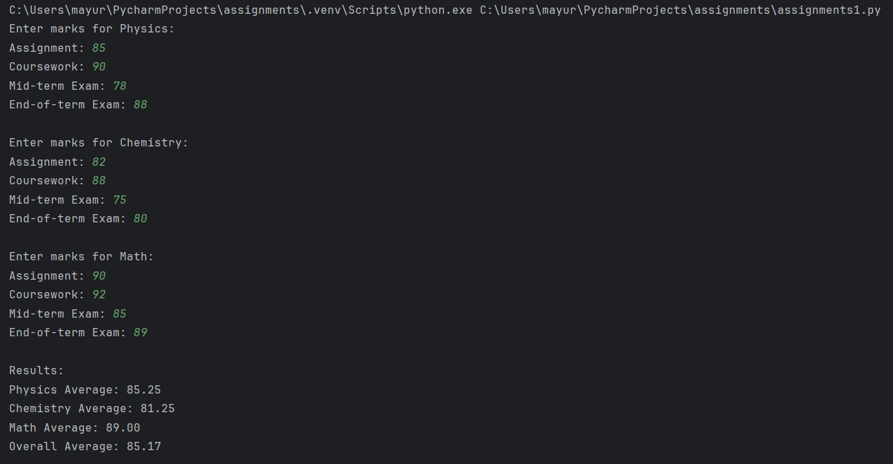
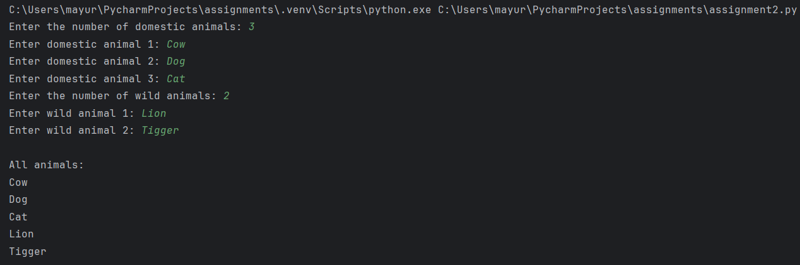
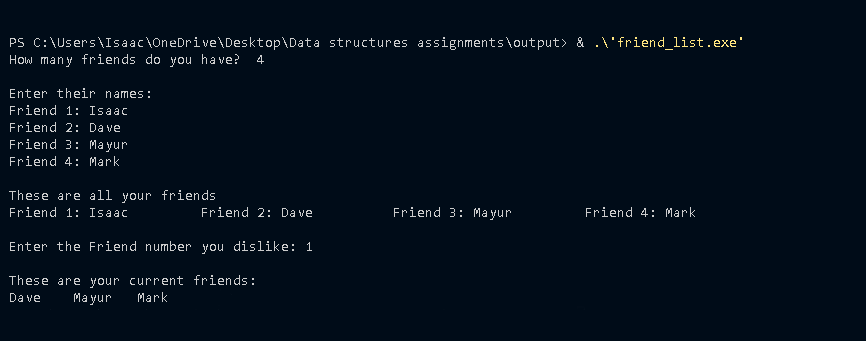
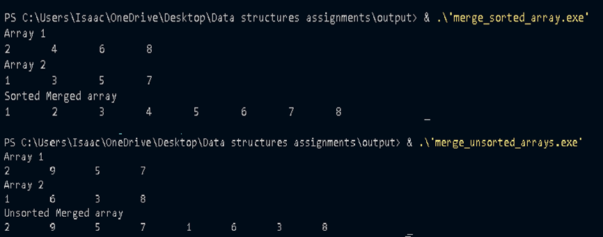
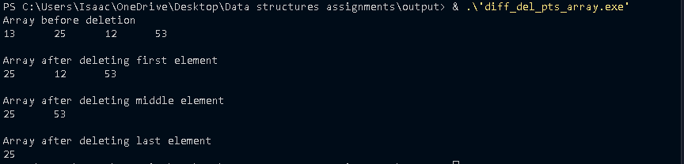

# Assignments
Project assignments repository! This README file provides an overview of the assignments and their corresponding outputs.

# Student Information

This table contains details of four students, including their names, courses, and roll numbers.

| **Name**             | **Course**               | **Roll Number** |
|----------------------|--------------------------|-----------------|
| Mayur Gujar          | D.I.T                    | 012240728       |
| Lubega Mark          | D.I.T                    | 012240523       |
| Dave Gorasiya        | Computer Science         | 012240257       |
| Namutali John Isaac  | Computer Science         | 012240554       |

---

## Table of Contents
- [Assignment 1](#assignment-1)
- [Assignment 2](#assignment-2)
- [Assignment 3](#assignment-3)
- [Assignment 4](#assignment-4)
- [Assignment 5](#assignment-5)
- [Assignment 6](#assignment-6)

---

## Assignment 1

### Question
Write a Python program that calculates the average of marks got by a student in three subjects ie Physics, Chemistry, Math...assume for each subject, four different tests were conducted; assignment, Course work, mid term and end of term exams.

### Output
Below is the output for Assignment 1:

---

## Assignment 2

### Question
Write a C program that accepts a group of N domestic animals and a group of X wild animals. Your program should print N + X animals after entering each group.

### Output
Below is the output for Assignment 2:

---

## Assignment 3

### Question
Write an algorithm to swap two numbers  as entered by the user AND 
Write pseudo code for swapping 2 numbers.

You can view the text file [here](assignment3.txt).

---

## Assignment 4

### Question

### Output
Below is the output for Assignment 4:

---

## Assignment 5

### Question
Write a C code showing how to merge two unsortated arrays and two sorted arrays.
### Output
Below is the output for Assignment 5:

---

## Assignment 6

### Question
Write a C code showing how to deleted an element from differnet possitoin from an array.

### Output
Below is the output for Assignment 6:

---
